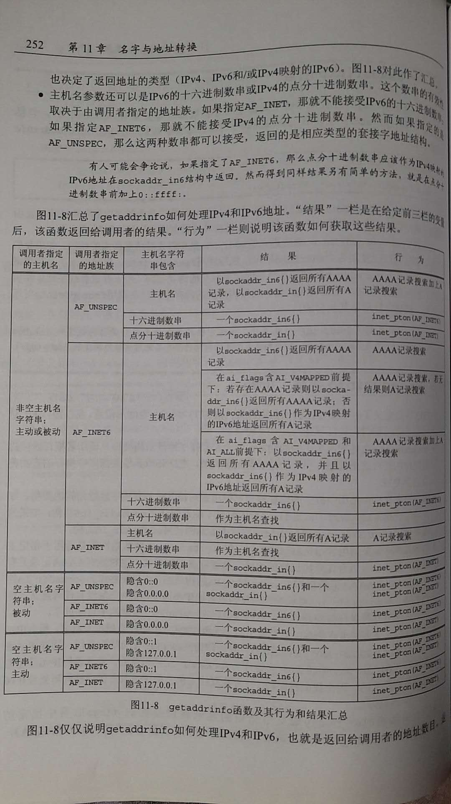

# getaddrinfo函数：IPv6

POSIX规范定义了getaddrinfo函数以及该函数为IPv4或IPv6返回的信息，我们应该注意以下几点

> - getaddrinfo在处理两个不同的输入：一个是**套接字地址结构类型**，调用者期待返回的地址结构符合这个类型；另一个是**资源记录类型**，在DNS或其他数据库中执行的查找符合这个类型
> - 由调用者在hints结构中提供的地址族指定调用者期待返回的套接字地址结构的类型
> - POSIX声称如果调用者指定AF_UNSPEC，那么getaddrinfo函数返回的是适合于指定主机名和服务名且适合任意协议族的地址
> - POSIX的这个声明也意味着如果设置了AI_PASSIVE标志但是没有指定主机名，那么IPv6通配地址(IN6ADDR_ANY_INIT或0::0)应该作为sockaddr_in6结构，同样IPv4通配地址(INADDR_ANY或0.0.0.0)应该作为sockaddr_in结构返回
> - 在hints结构的ai_family成员中指定的地址族以及在ai_flags成员中指定的AI_V4MAPPED和AL_ALL等标志决定了在DNS中查找的资源记录类型(A和/或AAAA)，也决定了返回地址的类型(IPv4、IPv6和/或IPv4映射的IPv6)
> - 主机名参数还可以是IPv6的十六进制数串或IPv4的点分十进制数串

## getaddrinfo函数及其行为和结果汇总

